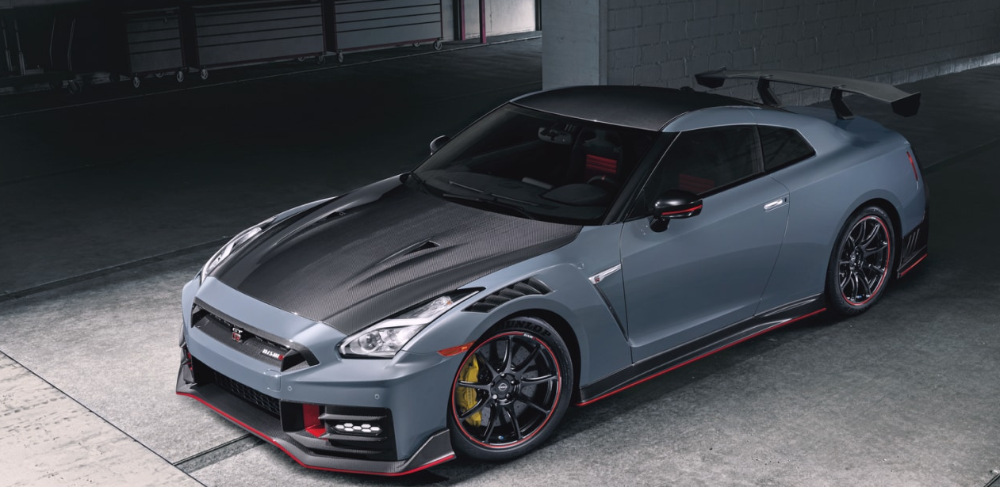

# 2025 Nissan R35 GT-R Nismo 

![https://media.ed.edmunds-media.com/nissan/gt-r/2024/oem/2024_nissan_gt-r_coupe_nismo_fq_oem_1_1280.jpg]

![https://www.nissanusa.com/content/dam/Nissan/us/vehicles/nismo-road-cars/nismo-redesign/nissan-gt-r-nismo-road-car-v2.jpg]

## Overview
A high-performance variant of the legendary R35 GT-R, the **2025 Nissan GT-R NISMO** highlights Nissan's history in motorsport. Its updated 3.8-liter twin-turbo *VR38DETT* V6 engine produces remarkable power and torque with precise tuning for performance fit for the racetrack. Highlights include revised suspension for quicker handling, carbon-ceramic brakes for increased stopping power, and improved aerodynamics with a more aggressive carbon fiber body kit. It has a race-inspired cockpit with contemporary technology and lightweight Recaro seats inside.

## Powertrain
The VR38DETT is a 3.8-liter twin-turbocharged V6 engine used in the Nissan GT-R (R35). It has an aluminum-alloy block and heads, plasma-sprayed cylinder bores to reduce weight and improve cooling, and uses forged internals for durability. The engine is hand-assembled by specialized technicians called Takumi. It delivers over 600 horsepower in its NISMO variant by using larger turbochargers and optimized tuning. The VR38DETT also features a dry sump lubrication system for consistent oil delivery and integrates an intercooler system to manage heat generated by the turbochargers. It is commonly modified by tuners for higher performance, with some builds exceeding 1,000 horsepower.

## Drivetrain
The drivetrain of the Nissan GT-R (R35) is centered around its ATTESA E-TS all-wheel-drive system, which provides dynamic power distribution between the front and rear wheels. The system uses an electronically controlled multi-plate clutch to determine the optimal torque split, primarily sending power to the rear wheels but engaging the front wheels when additional traction is needed. The transmission is a rear-mounted 6-speed dual-clutch automatic, paired with the engine via a carbon-fiber driveshaft. This transaxle layout improves weight distribution for better handling and stability. Gear changes are executed quickly and precisely, with paddle shifters providing manual control when desired. The GT-R’s drivetrain is designed to handle high levels of torque and horsepower, featuring a robust differential and advanced electronic controls to ensure performance and reliability in both street and track settings.

## Suspension
The suspension system of the Nissan GT-R (R35) is a multi-link setup designed for high-performance handling and stability. The front features a double-wishbone configuration, while the rear uses a multi-link design to optimize wheel control and traction. Constructed with aluminum components, the suspension reduces weight while maintaining strength. The GT-R is equipped with Bilstein DampTronic adjustable shock absorbers, which allow drivers to switch between different modes for comfort, sport, or track-focused driving. The system continuously monitors and adjusts damping force based on speed, road conditions, and driver input to enhance performance. Additionally, the GT-R incorporates a rear-mounted transaxle, which improves weight distribution by positioning the transmission and differential at the rear. This setup, combined with the ATTESA E-TS all-wheel-drive system, ensures precise handling, cornering stability, and balanced performance in various driving conditions.

## More changes to the NISMO include:
- Forged Rays Eng. Wheels
- Carbon fiber bodykit 
- Stiffer suspension 
- Upgraded turbos 

## Links
- [https://www.caranddriver.com/nissan/gt-r1](url)
- [https://www.drifted.com/vr38dett/](url)
- [https://www.topspeed.com/nissan-gt-r-2025-whats-new/](url)
